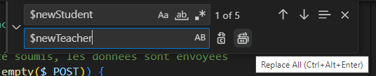

# Feedback

Le projet n'est pas entièrement fonctionnel, mais ce n'est pas grave, regardons ensemble ce qu'il te manquait pour faire mieux la prochaine fois 😉

## Retours Globaux

Au niveau du code, j'ai remarqué à plusieurs reprises du Code commenté non retiré avant le push, rien de grave, mais ça joue son rôle dans la clarté et lisibilité du code 😉 

## Retours Cas par Cas

### Main Controller

Pas grand chose de grave, mais petite note sur le fait qu'il aurait plutôt fallu appeler ce controller CoreController, de la même façon que tu as fait CoreModel 😉

MainController pourrait porter confusion, on pourrait croire qu'il s'agit du controller gérant les pages principales.

### Affichage des templates & sous-templates

Actuellement dans tes templates et ton code, tu affiche pour chaque page, un template complètement différent, ce qui te force à avoir dans chaque template, ton header, ta barre de navigation, ainsi que ton footer.

C'est problématique car il s'agit de code répété en grande quantité, et ça t'a porté préjudice. En effet, les liens dans la barre de navigation sont pour la pluparts cassés et sur certaines pages, tu n'a carrément pas de header/navbar/footer !

Mais alors.. Comment gérer ce problème ? 🤔

Il aurait fallu venir ajouter un dossier dans ton dossier views, nommé "partials" qui contiendrait les éléments réutilisable de ton projet : Le Header, la navbar ainsi que le footer.

Tu aurais donc trois fichiers dans ce dossier : header.tpl.php & footer.tpl.php & navbar.tpl.php

- Header contiendrait le header + le contenu du fichier navbar.tpl.php que tu aurait include.
- Navbar contiendrait uniquement la navbar
- Footer uniquement le footer

Maintenant que tu as ces trois fichiers, il ne te reste plus qu'a modifier ton MainController, la fonction show, pour avoir trois require_once au lieu d'un seul :

```php
require_once __DIR__ . '/../views/partials/header.tpl.php';
require_once __DIR__ . '/../views/' . $viewName . '.tpl.php';
require_once __DIR__ . '/../views/partials/footer.tpl.php';
```

Et voila, plus qu'a retirer le footer/navbar/header de tes autres vues et le tour est joué ! Tu as désormais un affichage automatique du header et du footer sur toute tes pages ! 🎉

C'est plus simple à maintenir, et ça évite les erreurs d'inatention/d'oubli ! 😀

### Titre dans la liste des étudiants

Attention, il n'y a pas de titre pour les étudiants ! Il faudrait retirer cette colonne du tableau ! 😛

### Copiés/Collés de code

De même ici, attention quand tu fais des copiés/collés de code ! Dans ton TeacherController, on retrouve la fonction studentAdd, avec encore plein de mentions de student tandis qu'on est censé être dans la partie professeurs du code !

J'imagine bien qu'il s'agit d'un copier coller pour aller plus vite, mais il ne faut pas oublier de relire son code pour ne rien oublier de l'ancien code ! 

Petit Tips 💡

Pour renommer efficacement chaque instance d'une variable, utilise CTRL + F puis rentre le nom de la variable à renommer, puis clique sur la petite flèche pour ouvrir le sous-menu de renommage ! Plus qu'a rentrer le nouveau nom dans le deuxième champ, et cliquer sur le bouton pour tout remplacer.



Attention, il fait la recherche dans le fichier entier, il pourrait remplacer des éléments que tu ne souhaite pas s'ils ont le même nom ! 

### Commentaires de typage des propriétés de models

Petit truc, mais important ici : N'oublie pas d'ajouter des commentaires de typages sur tes propriétés de models, cela permet à ton IDE de bien identifier le type de la variable, et de t'aider en conséquence (En plus de permettre aux autres développeurs d'être sûr du type de ta propriété) 😉

Petit rappel, voici comment faire un commentaire de propriété :

```php
/**
 * @var string
 */
private $email;

/**
 * @var int
 */
private $teacher_id;
```

### Espaces inutiles dans les fichiers

Attention, dans tes fichiers CoreModel.php & Teacher.php, on retrouve des espacements inutiles qui cassent la lisibilité du fichier, n'hésite pas à les retirer ! Ce sera bien plus lisibile ainsi 😉

Teacher.php
```php
class Teacher extends CoreModel
{
    private $id;
    private $firstname;
    private $lastname;
    private $job;
    private $status;
    
    public static function findAll()
    {
        $pdo = Database::getPDO();
        $sql = 'SELECT * FROM `teacher`';
        $pdoStatement = $pdo->query($sql);
        $results = $pdoStatement->fetchAll(PDO::FETCH_CLASS, 'App\Models\Teacher');

        return $results;
    }

    /**
     * Get the value of id
     */ 
    public function getId()
    {
        return $this->id;
    }
```

CoreModel.php
```php
abstract class CoreModel
{
    protected $created_at;

    protected $updated_at;
    
    abstract public static function findAll();

    /**
     * Get the value of created_at
     */ 
    public function getCreated_at()
    {
        return $this->created_at;
    }

    /**
     * Get the value of updated_at
     */ 
    public function getUpdated_at()
    {
        return $this->updated_at;
    }
}
```

## Ajout d'un étudiant

Pas mal du tout pour un premier jet ! On arrive bien à ajouter un étudiant dans la base de données ! Cependant, quelque chose cloche avec l'objectif initial !

Dans ton model Student, on ne retrouve pas la propriété teacher_id, ce qui empêche d'assigner un prof à un élève. De plus, dans ton formulaire, la liste des professeurs disponible est en dur, il faudrait plutôt afficher ça avec les données de la base, tu ne crois pas ? 😛

Vu que je suis sympa, je te montre même comment faire !

Dans ta fonction studentAdd de StudentController, il faut ajouter la récupération des professeurs :

```php
    $teacher = new Teacher();
    $teachers = $teacher->findAll();
```

Il faut ensuite passer la liste à ton template, comme tu l'a fait pour newStudent & errors.

Dans le template, il faut remplacer les professeurs en dur par :

```php
<label for="teacher">Prof</label>
    <select name="teacher" id="teacher" class="form-control">
        <option value="0">-</option>
        <?php foreach($viewData["teachers"] as $teacher): ?> // Boucle : Pour chaque Professeur
            <option value="<?= $teacher->getId() ?>"><?= $teacher->getFirstname() ?> - <?= $teacher->getJob() ?></option> // On ajoute une option, comportant l'id du prof en valeur, et en contenu son prénom + son Job
        <?php endforeach; ?> // Fin de la boucle
    </select>
```

Et voila, on affiche désormais la liste des profs de la base de données ! 😉
Il faudra juste récupérer le choix dans le traitement du formulaire, et l'enregistrer en base dans le newStudent ! 😀

## Petit mot de la fin

Pour tout ce qui reste (en gros, pour terminer le projet), je t'invite à jeter un oeil à la correction pour te guider ! 

Ne décourage pas, tu as les bases, tu avais juste besoin qu'on te reguide un peu, il ne te reste plus qu'à les appliquer et tu y arrivera sans problème !

Si tu as quelconque question concernant ce parcours (ou pas d'ailleurs), ou si tu as besoin d'aide pour pouvoir le terminer, n'hésite surtout pas à revenir me voir en message privé, je suis la pour aider en cas de besoin 😉