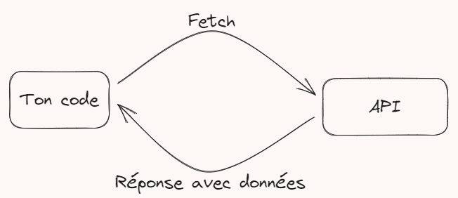

Hello .... ! 👋

La méthode [Fetch](https://developer.mozilla.org/fr/docs/Web/API/Fetch_API/Using_Fetch) permet de faire des [requêtes HTTP](https://www.ionos.fr/digitalguide/hebergement/aspects-techniques/requete-http/) asynchrones à des serveurs afin d'y récupérer des données que tu pourras alors utiliser dans ton code 😉 (Tant de possibilitées qui s'offrent à toi !)

Pour expliquer plus simplement, imagine dans le monde de la cuisine, que tu es en train de faire un plat. Cependant tu as besoins d'oeufs, que tu n'a pas chez toi, sans ça tu ne peut pas réaliser ton plat.

Pour les récupérer, tu va passer une commande (Voit ça comme la méthode fetch) à l'adresse du magasin de ton choix qui possède des oeufs (l'url que tu va requêter), et ensuite, tu recevra tes oeufs (la réponse avec les données). Ainsi, tu pourra finir ton plat 😀

Mais comment utiliser Fetch ?! 🤔

C'est très simple ! Il suffit de lui passer en paramètre l'url sur laquelle tu veut récupérer les données, puis de traiter les données récupérés !

```js
    fetch('http://tonurl.com') // On appelle fetch, avec l'url de ton choix en paramètre !
    .then(response => response.json()) // On récupère les données en JSON dans la réponse
    .then(data => console.log(data)) // On affiche les données dans la console
```

Voili, voilou pour un cas simple, mais laisse moi t'expliquer le truc étrange qui est apparu => .then !

then, qui veut dire "puis" ou "ensuite" en anglais, permet de définir des actions à exécuter une fois qu'une action à été traitée. Tu te souviens quand j'ai dis plus haut que fetch était une méthode asynchrone ?

Pour résumer, asynchrone, ça veut dire que le code, en parralèle d'éxécuter fetch (qui met plus ou moins de temps selon le serveur qu'il requête), va continuer de lire et exécuter le code en dessous ! C'est la qu'intervient nos .then, qui permettent d'effectuer des actions sur les données récupérés par fetch une fois celles-ci obtenues !

Pour te montrer un exemple plus concret, on va reprendre ton projet Skoule ! Imaginons que tu ai mis une route listant les étudiants, en format JSON (et juste ces données, rien d'autre !) et que tu voudrais qu'un bouton rafraichir existe pour la liste des étudiants, voici comment tu pourrais faire !

```js
    fetch('http://localhost:8000/api/students/list') // On appelle fetch sur l'url comportant la liste des étudiants
    .then(response => response.json()) // On récupère les données en JSON dans la réponse
    .then(data => {
        tbody = document.getElementsByTagName("tbody");
        tbody.innerHTML = '';
        // Récupérer et vider le tbody du tableau des étudiants actuellement affiché

        Object.values(data).forEach(student => {
            // Ensuite on a plus qu'a créer et append chaque ligne du tableau avec les données de chaque étudiant qu'on vient de récupérer avec fetch 😉
        });
    })
```

Petite information en plus avant de passer à la suite : Les url que tu peut requêter pour récupérer des données de cette manière, sont appellées [API](https://developer.mozilla.org/fr/docs/Learn/JavaScript/Client-side_web_APIs/Introduction) (application programming interface ou « interface de programmation d'application »).



Sachant que fetch permet de faire des requêtes HTTP, tu peut également envoyer des données avec, et récupérer des données en retour ! Nombreuses sont les utilisations ! 

Voila pour l'utilisation de base de fetch ! Je vais te laisser jeter un oeil à la documentation pour découvrir le reste des possibilités que la méthode offre ! N'hésite pas à revenir me voir si tu as des questions concernant des utilisations plus avancées ! 😉