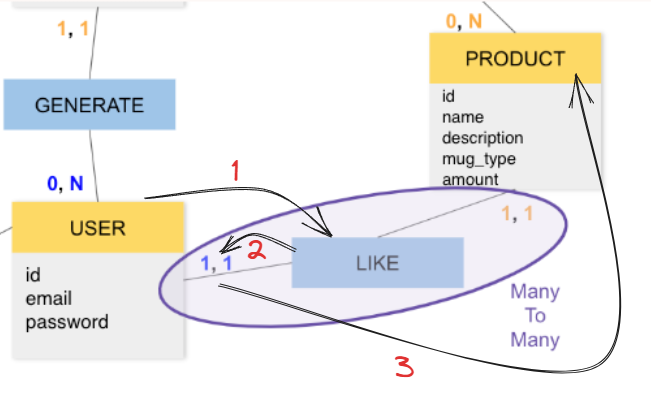

Hello .... ! 👋

J'ai jeté un oeil à ton MCD, et malheureusement, il n'est pas valide sur un seul point ! Le reste étant tout bon ! 😉

La relation entre User et Product n'est pas bonne. Actuellement, avec la relation qu'ils ont, un utilisateur peut liker qu'un seul produit, et un produit ne peut être liké que par un seul utilisateur.

Mais.. comment faire pour ne plus se tromper ?

C'est simple ! A l'oral (ou dans ta tête 😛), il suffit de lire la relation de cette façon :

En partant de User :

1 ) Un User peut Liker 
2 ) 1 et un seul
3 ) Product

En lisant de cette façon, on est sur de comprendre comment fonctionne notre relation, et la on se rend bien compte en lisant que ça ne va pas si notre utilisateur peut liker qu'un seul produit.

On peut faire de même en partant de Product :

1 ) Un Product peut être liké par
2 ) 1 et un seul
3 ) User

De même, on se rend compte à nouveau qu'il y a un problème en le lisant. Sans compter qu'un User est obligé d'avoir mis un like, et un Product est obligé d'avoir été liké, ce qui pose grandement problème.

Reprenons ensemble la lecture des cardinalités :

Une cardinalitée est divisée en deux indicateurs : x,x

Le premier indicateur, qui est soit 0 ou 1, indique si oui, ou non, l'entité est obligé d'avoir une relation de ce type.

Si on reprends ton MCD, le premier indicateur d'User montre qu'un User est obligé d'avoir une relation LIKE avec Product.

Pour le deuxième Indicateur, qui est soit de 1 ou n, indique le nombre de relations de ce type possible : 1 pour 1, n pour plusieurs.

Si on reprends ton MCD, le deuxième indicateur d'User montre qu'un User ne peut avoir qu'une seul relation LIKE avec Product.

Si l'on reprends ton besoin, en partant de User, voici ce qu'il nous faudrait : 0,n

Car : Un utilisateur n'est pas obligé de liker un produit, et il peut en liker plusieurs.

En partant de Product, de même : 0,n

Car : Un Produit n'est pas obligé d'être liké, et il peut être liké par plusieurs utilisateur.

C'est ce qu'on appelle un ManyToMany ! 😉

Voici une petite ressource concernant les cardinalitées pour t'aider au besoin : [Click-moi](https://www.base-de-donnees.com/cardinalites/)

De plus, pour t'aider dans ta création de MCD, voici quelques outils :

- [Jmerise](http://www.jfreesoft.com/JMerise/) (C'est celui que j'utilise, personellement)
- [Looping](https://www.looping-mcd.fr/)

En cas de questions supplémentaire sur les MCD, je reste à ta disposition ! N'hésite pas à m'envoyer un message privé, je serais ravi d'éclaircir ta lanterne ! 😉